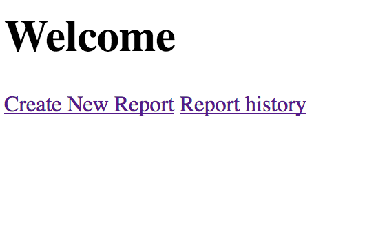
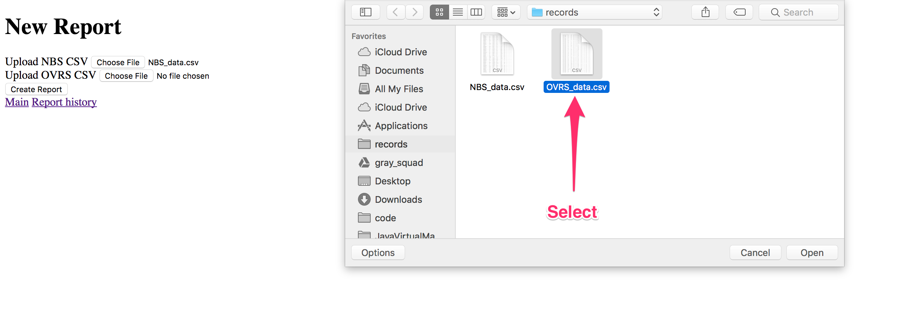

Title         : Manual
Author        : _by Team FHIRfighters_
Logo          : False

[TITLE]

[TOC]

# General 

Information of the project and team that worked on it:

* Team: FHIRfighters
* Team Members:  Phillip Birmingham, Enrique Gonzalez, Allan Reyes, Reed Allred
* Project Name: Newborn Screening Data on FHIR
* GitHub link: [https://github.com/CDCgov/GaTech-Fall2017-Newborn-FHIRFighters].

# User Manual

## How To Run The App

1. [Clone repository][#sec-how-to-clone-the-repository] ([https://github.com/CDCgov/GaTech-Fall2017-Newborn-FHIRFighters])
2. Ensure the correct versions of Docker and Docker Compose are installed per the [dependencies][#sec-dependencies].
3. Run `docker-compose up`
4. The application is at [http://localhost:3000]
5. The associated FHIR instance is available at [http://localhost:8080]

## How to use the app to generate a report

1. Go to [http://localhost:3000] in your browser

2. You should see the welcome page:  

3. To make a report click "Create Report" link:  

4. You will be taken to the report page:  

5. Click on the choose file for New Born Screening (NBS):  

6. Navigate to the CSV file for NBS:  

   _**Note** The file type must be CSV, and the columns must match the names listed in the [error section][#sec-errors-when-running-the-app]._  

7. Click on the choose file for Office of Vital records and statistics (OVRS):  

8. Navigate to the CSV file for OVRS:  

   _**Note** The file type must be CSV, and the columns must match the names listed in the [error section][#sec-errors-when-running-the-app]._  

9. Click on "Create Report" button to generate a report:  

10. You will then be taken to the new discrepancy report:  

_**Note** See [error section][#sec-errors-when-running-the-app] for any issues. Also see [how to read a report section][#sec-how-to-read-a-report] to further understand the report._

## Errors when running the app

When creating a new report, if the file is not a CSV file or the file format is not correct, any error will be seen like this:
> Failed to load files, csv format was not correct (csv headers may not be correct)  
 

To avoid errors with NBS and OVRS make sure you have these requirements in place:  

* The file type is a CSV
* the columns match this list:

**NBS csv file columns**

* NAME
* BABYS_LAST_NAME
* BABYS_FIRST_NAME
* BIRTHDATE
* BABYS_SEX
* MOTHERS_LAST_NAME
* MOTHERS_BIRTHDATE
* BIRTH_WEIGHT
* MULTIPLE_BIRTH
* BIRTH_LENGTH

**OVRS csv file columns**

 * StateFileNumber
 * NewbornScreeningNumber
 * ChildLast
 * ChildFirst
 * BirthCCYY
 * BirthMM
 * BirthDD
 * Gender
 * MomLast
 * MomBirthCCYY
 * MomBirthMM
 * MomBirthDD
 * BirthWeightGrams
 * Plurality
 * ChildLengthCm 

## How to read a report

The top row consists of the report column labels. Each numbered row below shows an individual record in which the attributes show a discrepancy when compared by NBS and OVRS.  

Here is a description of what each discrepancy report label means:  

* **#**: This column numbers the records in which discrepancies were found.
* **Kit ID**: The kit number linked to the NBS and OVRS records.
* **Attributes**: These are the column labels that can be found in the OVRS csv file.
* **NBS**: The value that is found in the NBS record in the NBS csv file.
* **OVRS**: The value that is found in the OVRS record in the OVRS csv file.

_(Looking at the first record found with a discrepancy)_  

The Total number of discrepancy can be found at the bottom of the report:  

## Saving the discrepancy report to FHIR

To save a discrepancy report to FHIR, first [create a report][#sec-how-to-use-the-app-to-generate-a-report] or go into an [already created report][#sec-saving-the-discrepancy-report-to-fhir].

Click on the bottom at the bottom of the report called "Save NBS to FHIR":  

You will see this message "Successfully saved to FHIR!" once the data has been successfully saved:  

_**Note:** The local FHIR app can be found at [http://localhost:8080]_.  

## View an already existing discrepancy report

From the welcome page click on the "Report history" link.  

You will then see all the history of the already created discrepancy reports.  

Click on the "Show" link on the report you want to view.  

# Developer Manual

## How To Deploy

The main Rails application can be deployed as a containerized application. The application can be configured with the following environment variables:

|-------------------------|-------------------------------------------------|
| Variable                | Description                                     |
+-------------------------|:-----------------------------------------------:+
| DATABASE_URL            | URL to PostgreSQL database. See: _database.yml_ |
| FHIR_URL                | URL to FHIR server.                             |
| RAILS_ENV	Environment.  | Recommended: production                         |
| RAILS_RELATIVE_URL_ROOT | Deploy to a relative root. Example: /app        |
|-------------------------|-------------------------------------------------|

## How To Set Up For Native (Local) Development

Ensure all the [dependencies][#sec-dependencies] are installed.
Run bin/setup.
Run bin/rails server.

## How To Test

Ensure all the [dependencies][#sec-dependencies] are installed.
Run bin/test.

# Informational

## Dependencies

This is a Rails [v5.1.4] application that requires:

* [Docker ~> 17.09]
* [Docker Compose ~> 1.17]
* [Ruby ~> 2.4]
* [Bundler -> 1.15]
* [Node.js ~> 8.7]
* [Yarn ~> 1.2]
* [PostgreSQL ~> 9.6]

## How to clone the Repository

1. [Install Git]
2. Open terminal/command line
3. Navigate to the directory/folder you want to clone the repository to.
4. Enter this Git command: `git clone https://github.com/CDCgov/GaTech-Fall2017-Newborn-FHIRFighters`

_Need to brush up on git, try this [Git tutorial]._

[https://github.com/CDCgov/GaTech-Fall2017-Newborn-FHIRFighters]: https://github.com/CDCgov/GaTech-Fall2017-Newborn-FHIRFighters "GitHub"
[v5.1.4]: http://guides.rubyonrails.org/
[Docker ~> 17.09]: https://www.docker.com/
[Docker Compose ~> 1.17]: https://docs.docker.com/compose/
[Ruby ~> 2.4]:https://www.ruby-lang.org
[Bundler -> 1.15]: https://bundler.io/
[Node.js ~> 8.7]: https://nodejs.org
[Yarn ~> 1.2]: https://yarnpkg.com
[PostgreSQL ~> 9.6]: https://www.postgresql.org/
[Install Git]: https://git-scm.com/book/en/v2/Getting-Started-Installing-Git
[Git tutorial]: https://try.github.io/levels/1/challenges/1
[http://localhost:3000]: http://localhost:3000
[http://localhost:8080]: http://localhost:8080
