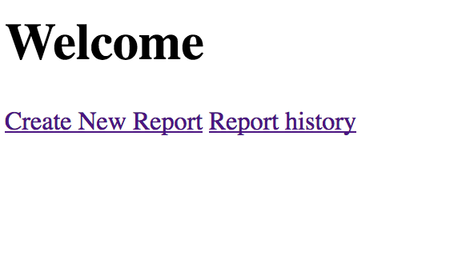
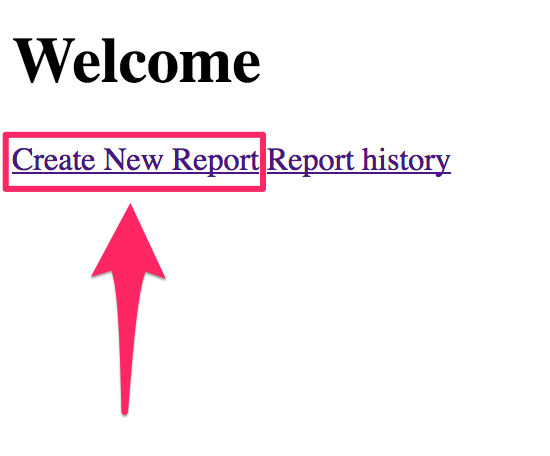
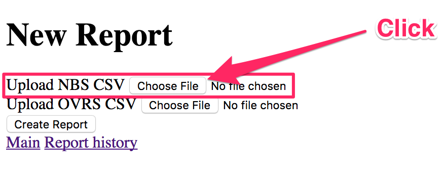
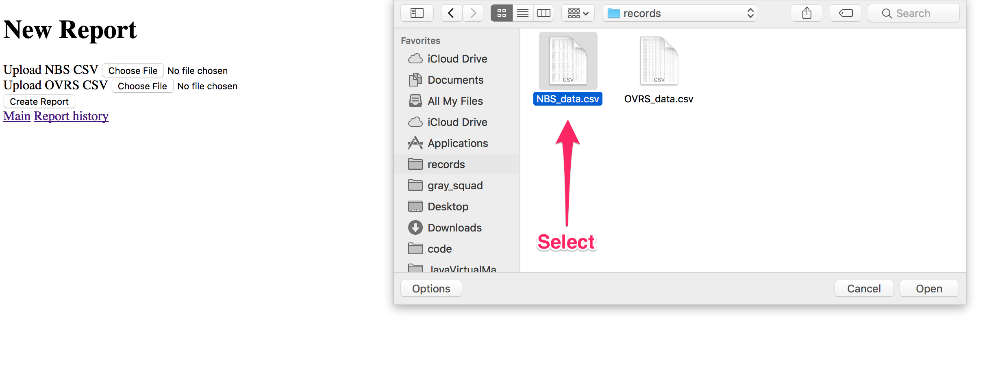
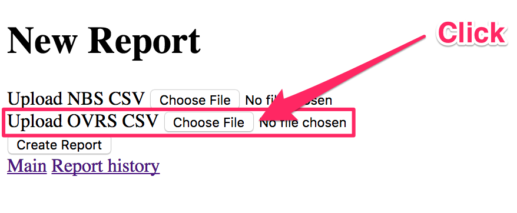
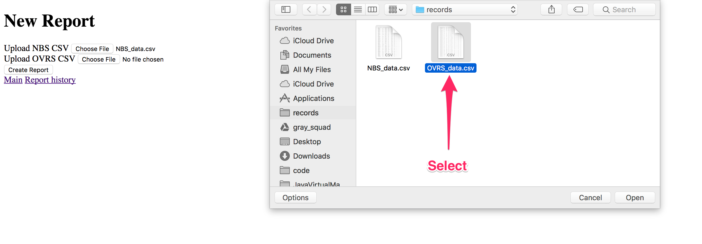
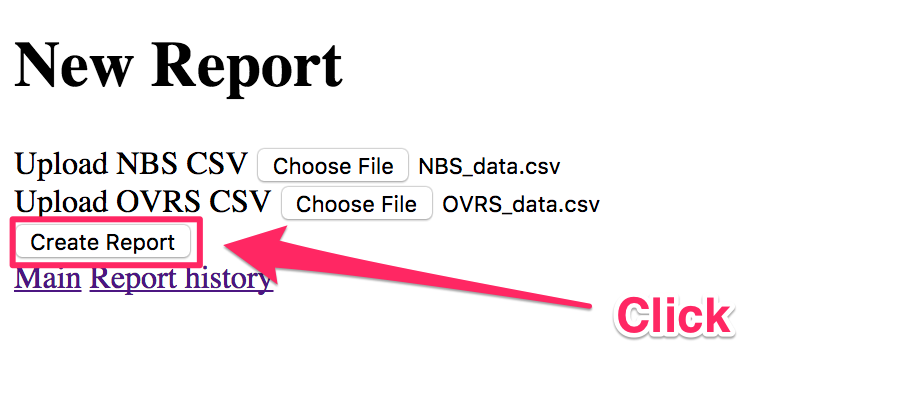
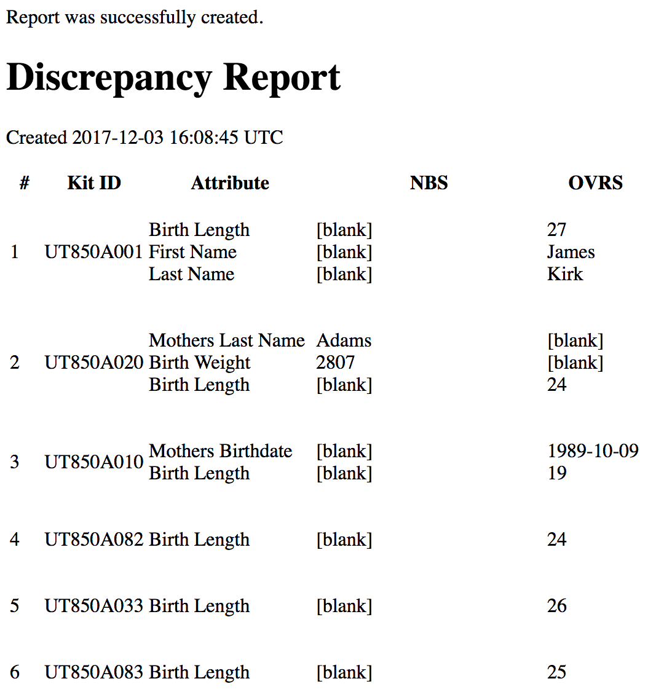

Special Instructions
====================

## How To Run

1. Ensure the correct versions of [Docker][docker] and [Docker Compose][compose]
   are installed per the [dependencies](#dependencies).
2. Run `docker-compose up`.
3. The application is at http://localhost:3000
4. The associated FHIR instance is available at http://localhost:8080

## How To Deploy

The main [Rails][rails] application can be deployed as a containerized
application. The application can be configured with the following environment
variables:

| Variable                  | Description                                      |
|---------------------------|--------------------------------------------------|
| `DATABASE_URL`            | URL to PostgreSQL database. See: `database.yml`  |
| `FHIR_URL`                | URL to FHIR server.                              |
| `RAILS_ENV`               | Environment. Recommended: `production`           |
| `RAILS_RELATIVE_URL_ROOT` | Deploy to a relative root. Example: `/app`       |

## How To Set Up For Native (Local) Development

1. Ensure all the [dependencies](#dependencies) are installed.
2. Run `bin/setup`.
3. Run `bin/rails server`.

## How To Test

1. Ensure all the [dependencies](#dependencies) are installed.
2. Run `bin/test`.

## How to Use the Application

See `Manual - FHIRfighters.(md|pdf)` for more information.

### How to use the app to generate a report

Go to http://localhost:3000 in your browser

You should see the welcome page:

To make a report click "Create Report" link:

You will be taken to the report page:

Click on the choose file for Newborn Screening (NBS):

Navigate to the CSV file for NBS:

Click on the choose file for Office of Vital records and statistics (OVRS):

Navigate to the CSV file for OVRS:

> Note: the file type must be CSV, and the columns must match the names listed
> in the error section

Click on "Create Report" button to generate a report:

You will then be taken to the new discrepancy report:

## Dependencies

This is a [Rails v5.1.4][rails] application that requires:

- [Docker ~> 17.09][docker]
- [Docker Compose ~> 1.17][compose]
- [Ruby ~> 2.4][ruby]
- [Bundler -> 1.15][bundler]
- [Node.js ~> 8.7][node]
- [Yarn ~> 1.2][yarn]
- [PostgreSQL ~> 9.6][postgres]

[bundler]:  https://bundler.io
[compose]:  https://docs.docker.com/compose
[docker]:   https://docker.com
[guard]:    https://github.com/guard/guard
[node]:     https://nodejs.org
[picobox]:  https://github.com/surzycki/picobox
[postgres]: https://www.postgresql.org
[rails]:    https://rubyonrails.org
[reqs]:     http://cs6440.gatech.edu/wp-content/uploads/sites/634/2017/09/38.-CatalogPageCDCUtahJones-Braun.pdf
[rspec]:    https://rspec.info
[rubocop]:  http://rubocop.readthedocs.io/en/latest
[ruby]:     https://www.ruby-lang.org
[webpack]:  https://webpack.js.org
[yarn]:     https://yarnpkg.com/en
